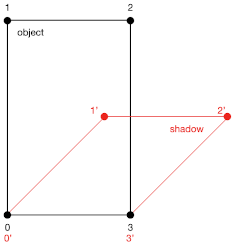

# 2D Shadow

The 2D shadow rendering in [West of Loathing](http://westofloathing.com/) has interested me a lot.
So, in this project, I try to achieve a similar effect.

# Method

Each frame is separated into two layers.
One is for rendering objects, the other one is for rendering shadows.
The object layer is rendered after the shadow layer.

When rendering the shadow, use an affine transformation matrix to deform it.

For example, vertices `0~3` are transformed into `0'~3'`.
I use [getAffineTransform](https://docs.opencv.org/3.4/da/d54/group__imgproc__transform.html#ga8f6d378f9f8eebb5cb55cd3ae295a999)
and [warpAffine](https://docs.opencv.org/3.4/da/d54/group__imgproc__transform.html#ga0203d9ee5fcd28d40dbc4a1ea4451983)
of OpenCV to perform this transformation.

The transformation matrix is related with the light source.

    // Given vertices 0, 1, 2
    delta <- objectCenter - lightPos;
    0' <- 0;
    1' <- 0' + delta * scale;
    2' <- 1' + Point2D(width, 0);

    // Then, `0, 1, 2` and `0', 1', 2'` are used to compute the matrix.

# Note

The key is how to design the transformation matrix.

Different matrix can produce different shadow shapes.
The one used in the mentioned game is a little different from mine.
But the basic concept is the same.

# Result

